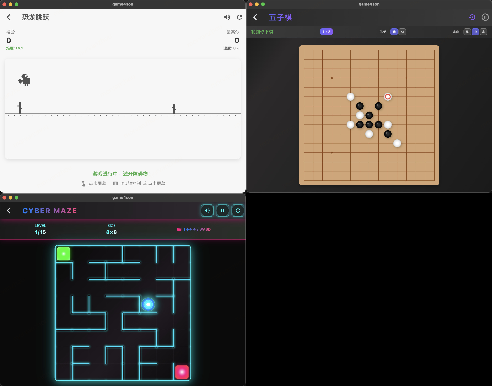

# 🎮 不求人，用 AI 开发儿子想玩的游戏合集

这个项目的背景：

我儿子今年 5 岁，刚接触游戏，玩过 switch，一点点手游。但是在网上找合适的小游戏时，发现并没有很好找，而且要不是看很多广告，要不是种类太多，还有些不好的游戏在集合页中。所以我干脆用 AI 来开发一些他想玩的游戏好了。


## 🌟 立即体验

不想自己编译？没问题！直接下载最新版本开始游戏：

**👉 [点击这里下载最新版本](https://github.com/MorvanZhou/game4son/releases)**

支持 Windows、macOS、iOS、Android 等多个平台！

## 📱 应用截图

<div align="center">



</div>

## 🎯 游戏列表

- 🦕 **恐龙跳跳** (类似Chrome恐龙游戏)
- 🌟 **赛博迷宫** 
- ⚫⚪ **五子棋对战** - 全新升级！智能AI，三档难度


## 🚀 开发者信息

### 环境要求
- Flutter 3.7.2 或更高版本
- 支持 iOS、Android、macOS、Windows、Linux、Web

### 快速开始
```bash
# 克隆项目
git clone https://github.com/MorvanZhou/game4son.git

# 进入项目目录
cd game4son

# 安装依赖
flutter pub get

# 运行应用
flutter run
```

### 项目结构
```
lib/
├── main.dart                    # 应用入口
├── screens/
│   └── game_collection_home.dart  # 游戏合集首页
├── games/
│   ├── common/
│   │   └── sound_manager.dart   # 通用音频管理
│   └── maze/
│       ├── models/              # 迷宫游戏数据模型
│       ├── widgets/             # 迷宫游戏组件
│       ├── screens/             # 迷宫游戏页面
│       └── services/            # 迷宫游戏服务
└── assets/                      # 游戏资源文件
    └── sounds/                  # 音效文件
```

## 🤝 反馈与支持

遇到问题或有好的建议？欢迎：
- 提交 [GitHub Issues](https://github.com/MorvanZhou/game4son/issues)
- 给项目点个 ⭐ 星标支持一下

## 📋 更新日志

### v2.0.0 (2025-06-09)
- 🎮 重构为游戏合集项目
- ✨ 新增现代化游戏选择首页
- 🎨 重新设计应用主题和视觉风格
- 📱 优化跨平台体验

### v1.0.0
- 🌟 发布赛博朋克迷宫游戏
- 🎵 添加音效系统
- 🏆 实现15关卡系统

---

**开始你的游戏冒险之旅吧！🚀**
