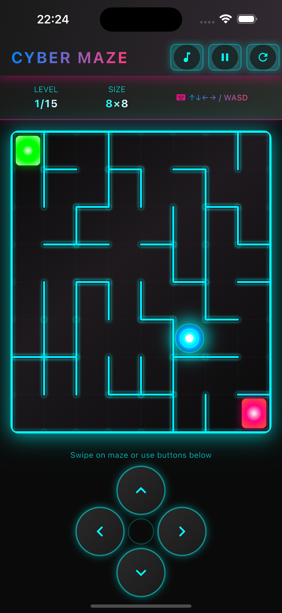
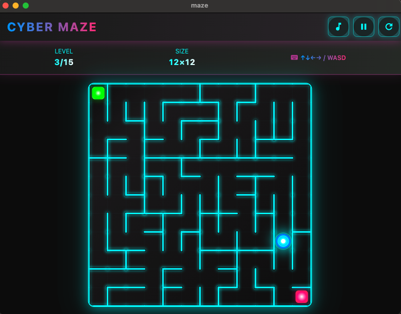

# 🎮 Flutter 游戏合集

一个精心设计的移动游戏合集！包含多种有趣的小游戏，让你在闲暇时光享受游戏的乐趣。

## 🌟 立即体验

不想自己编译？没问题！直接下载最新版本开始游戏：

**👉 [点击这里下载最新版本](https://github.com/MorvanZhou/maze-game/releases)**

支持 Windows、macOS、iOS、Android 等多个平台！

## 📱 应用截图

<div align="center">

### iPhone 版本


### macOS 版本  


</div>

## 🎯 游戏列表

### 🌟 赛博朋克迷宫
- **游戏类型**: 益智解谜
- **风格**: 赛博朋克 + 霓虹灯效果
- **特色**: 15个渐进式关卡，支持多种操作方式
- **亮点**: 沉浸式音效、华丽动画效果、智能迷宫生成

### 🎯 更多游戏 (即将推出)
- **射击游戏**: 经典太空射击玩法
- **益智解谜**: 挑战你的逻辑思维
- **动作冒险**: 更多精彩内容正在开发中...

## 🎮 操作说明

### 赛博朋克迷宫
**目标**: 控制发光的小球从绿色起点走到粉色终点

**控制方法**:
- **电脑**: 方向键 ↑↓←→ 或 WASD 键
- **手机/平板**: 滑动屏幕或点击虚拟按钮

**游戏规则**:
- 青色墙壁无法穿越
- 找到正确路径到达终点
- 完成所有15关成为迷宫大师

## ✨ 应用特色

- 🎨 **多样化游戏风格**: 每个游戏都有独特的视觉设计
- 🎮 **全平台支持**: 手机、电脑、平板都能畅玩
- 🎵 **优质音效**: 每个游戏都有专属背景音乐和音效
- 📱 **现代化界面**: 流畅的动画和直观的操作体验
- 🏆 **渐进难度**: 从简单到困难，循序渐进的游戏体验
- 🔧 **智能适配**: 自动适配不同屏幕尺寸和操作方式

## 🏆 关卡系统 (赛博朋克迷宫)

- **入门关卡 (1-5关)**: 8×8 迷宫，熟悉操作
- **进阶关卡 (6-10关)**: 逐渐增大的迷宫尺寸
- **挑战关卡 (11-15关)**: 20×20 大型迷宫，考验耐心

## 🛠️ 技术特色

- **Flutter 跨平台**: 一套代码运行在所有平台
- **模块化设计**: 每个游戏独立开发，易于维护
- **动画引擎**: 流畅的过渡动画和视觉效果
- **音频管理**: 智能的背景音乐和音效控制
- **响应式布局**: 完美适配各种屏幕尺寸

## 🚀 开发者信息

### 环境要求
- Flutter 3.7.2 或更高版本
- 支持 iOS、Android、macOS、Windows、Linux、Web

### 快速开始
```bash
# 克隆项目
git clone https://github.com/MorvanZhou/maze-game.git

# 进入项目目录
cd maze-game

# 安装依赖
flutter pub get

# 运行应用
flutter run
```

### 项目结构
```
lib/
├── main.dart                    # 应用入口
├── screens/
│   └── game_collection_home.dart  # 游戏合集首页
├── games/
│   ├── common/
│   │   └── sound_manager.dart   # 通用音频管理
│   └── maze/
│       ├── models/              # 迷宫游戏数据模型
│       ├── widgets/             # 迷宫游戏组件
│       ├── screens/             # 迷宫游戏页面
│       └── services/            # 迷宫游戏服务
└── assets/                      # 游戏资源文件
    └── sounds/                  # 音效文件
```

## 🤝 反馈与支持

遇到问题或有好的建议？欢迎：
- 提交 [GitHub Issues](https://github.com/MorvanZhou/maze-game/issues)
- 给项目点个 ⭐ 星标支持一下

## 📋 更新日志

### v2.0.0 (2025-06-09)
- 🎮 重构为游戏合集项目
- ✨ 新增现代化游戏选择首页
- 🎨 重新设计应用主题和视觉风格
- 📱 优化跨平台体验

### v1.0.0
- 🌟 发布赛博朋克迷宫游戏
- 🎵 添加音效系统
- 🏆 实现15关卡系统

---

**开始你的游戏冒险之旅吧！🚀**
